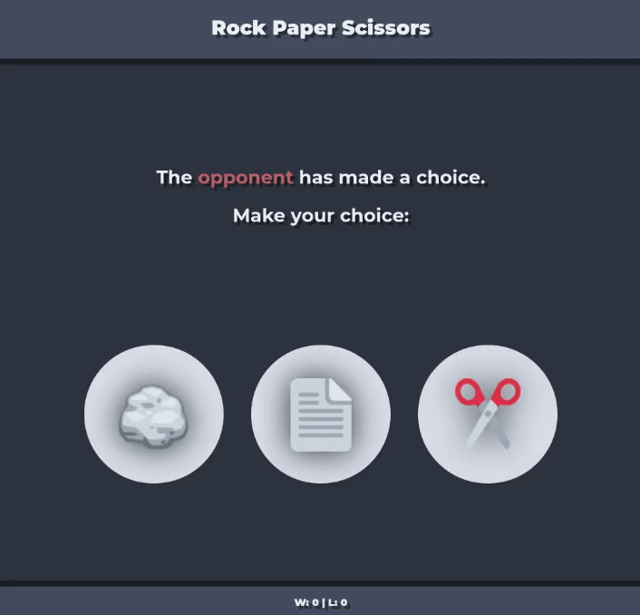

# 🪨📄✂️: Svelte™ edition

A super simple Rock Paper Scissors game made using Svelte.

## Features

- Play Rock Paper Scissors against **real AI**! (`Math.random()`)
- Count your **wins** and **losses**! (unbelievable)
- **WOW IT LOOKS SO GOOD!**

## Demo

## How do I run this

1. clone
2. `deno install`
3. `deno task dev`
4. open the localhost link that appears

## todo

- [ ] multiplayer ?
- [ ] better function names
- [ ] animations

## Credits

[Svelte Tutorial](https://svelte.dev/tutorial/svelte) &mdash; Svelte Tutorial
[Svelte Docs](https://svelte.dev/docs/svelte) &mdash; Svelte Docs
[Stackoverflow](https://stackoverflow.com) &mdash; yes
